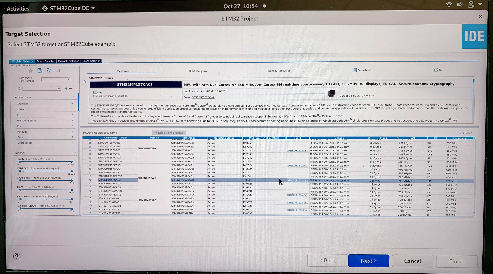
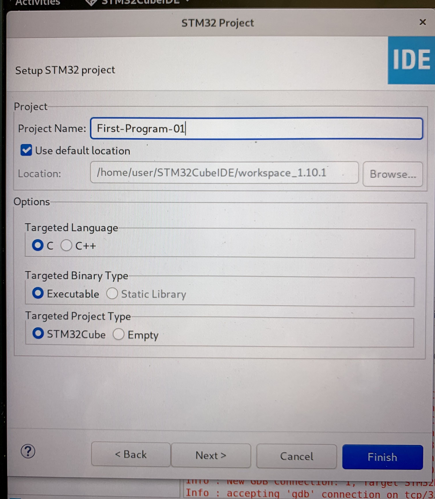
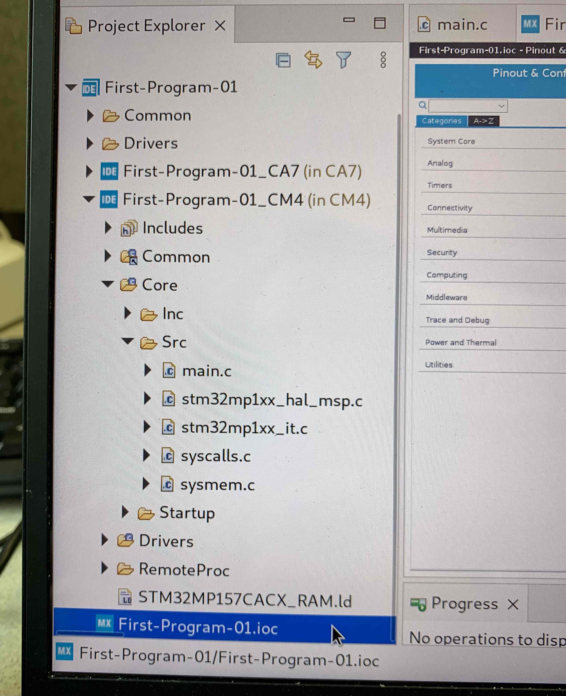
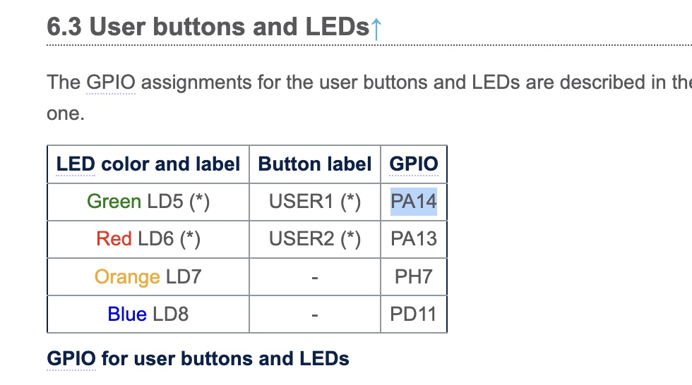
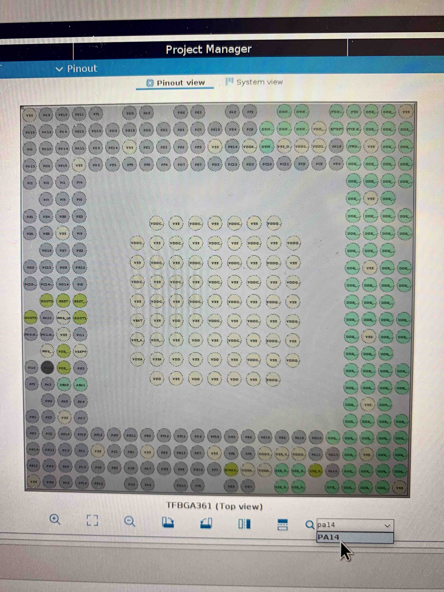
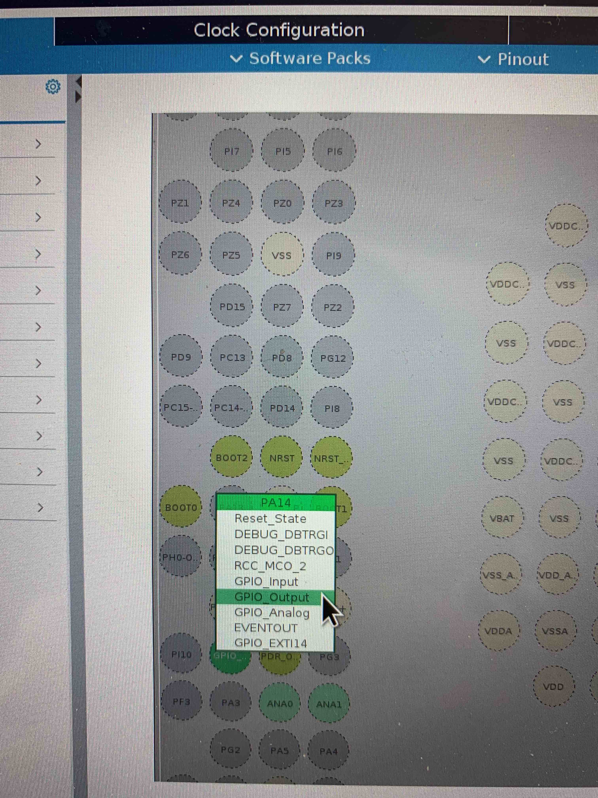

# First Program with IDE

Following the **IDE Installation guidelines** it's time to create a simple IDE project which will 

# IDE Project Configuration 

- Open IDE and select the currernt workspace or create a new one (it doesn't matter, workspace can hold multiple separate projects).

- Select **New > STM32 Project** A pop up window will appear in which you have to select the spesific target board you are working on. In our case is the **STM32MP1-57C-DK2**

- Name the project, In our case is the **First-Program**, and leave default the other fields. and select 

- The project structure has:
    - an **ioc** file which is the PIN map of the board 
    - the **CA7**, and **CM4** folders which contains the execution programs and drivers of the each processor
    

# First Program

- For the current LAB project purposes we will mostly use 2 files:
    - The **ioc** file in which we will configure the PINs of the board 
    - And the **mean.c** file in the **CM4>Core>Src** folder
    
- In the **ioc** file we select which PIN we will use for the current project purposes. Order to make the Green LED blink (https://wiki.st.com/stm32mpu/wiki/STM32MP157x-DKx_-_hardware_description#User_buttons_and_LEDs), we have to modify and lock the **PA14 PIN**:

- Select the **PA14 PIN**: and LEFT Click on it, then select **GPIO_Output** 

- Select again the **PA14 PIN**: and RIGHT Click on it, then select

# References
- https://www.youtube.com/watch?v=Azr5vjbgACM&list=PLnMKNibPkDnFCosVVv98U5dCulE6T3Iy8&index=3
- https://wiki.st.com/stm32mpu/wiki/Getting_started/STM32MP1_boards/STM32MP157x-DK2/Develop_on_Arm%C2%AE_Cortex%C2%AE-M4/Modify,_rebuild_and_reload_a_firmware
