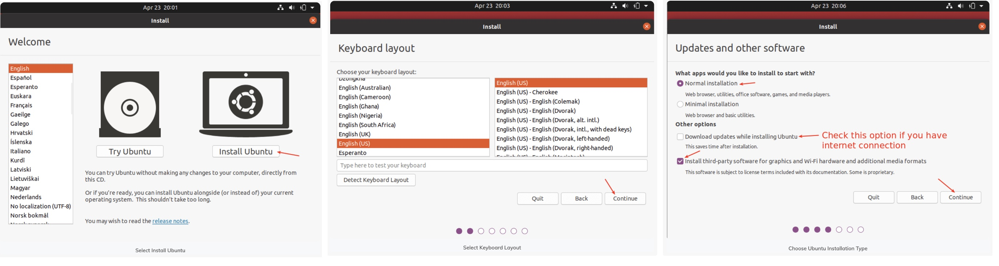
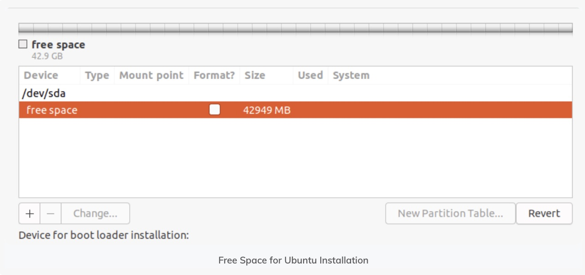
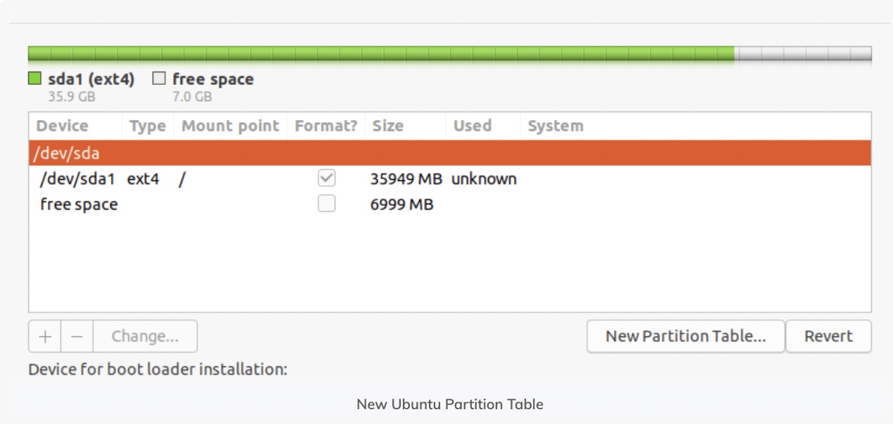
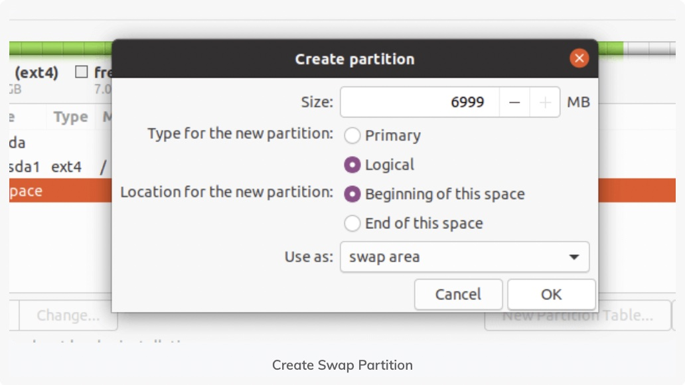
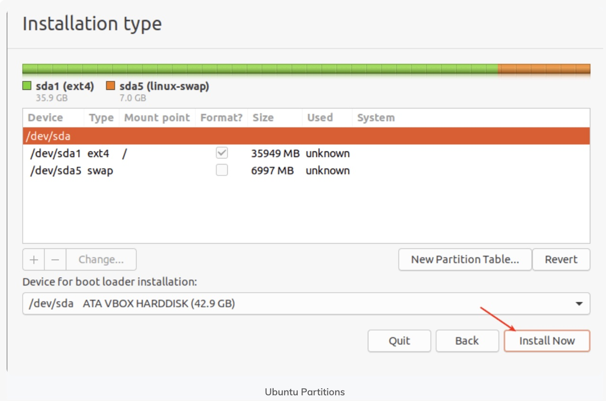
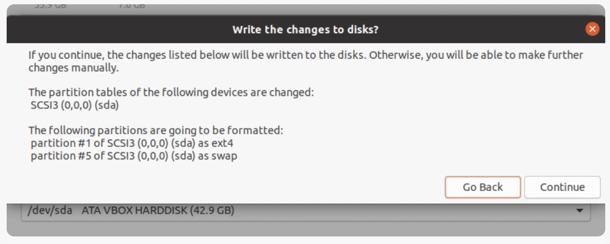
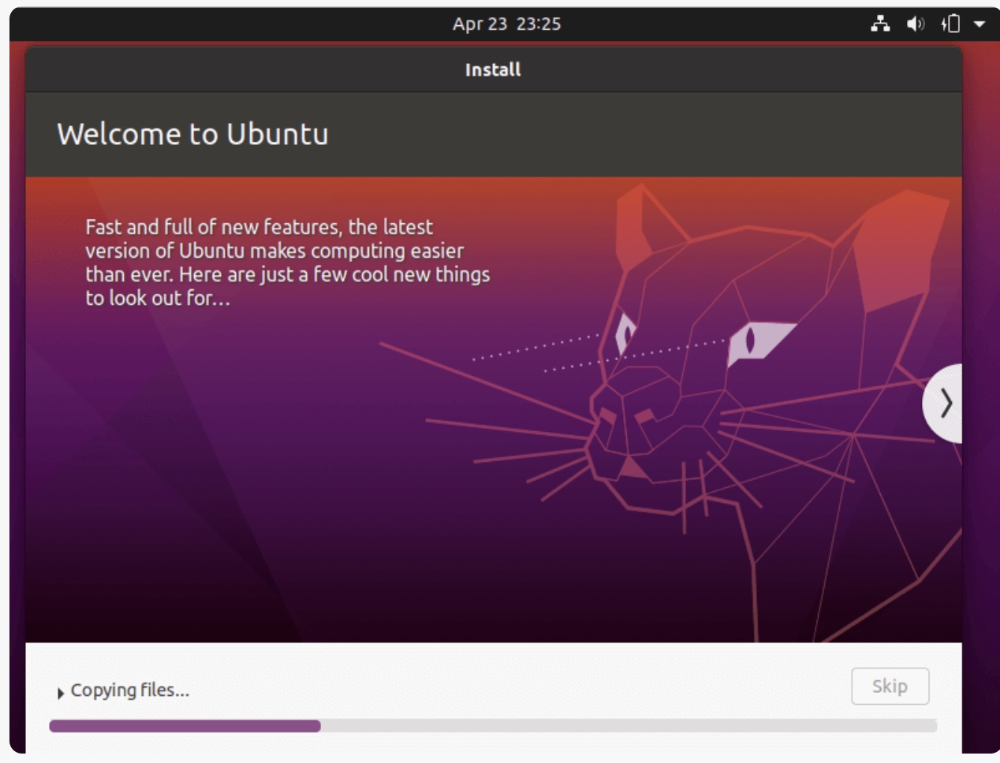

# Tutorial for Ubuntu 22.04 LTS Installation 

Ubuntu 22.04 New Features:
- Linux Kernel 5.15 LTS
- Gnome 42 
- Various visual improvements
- Optimization for Raspberry Pi 4

This tutorial is for a computer with Windows as the current sole operation system and we aim to have a dual boot with Windows and Ubuntu.

# Step 1: Download the Ubuntu 0S

From Ubuntu’s official website navigate to Downloads and select Ubuntu Desktop (follow the link: https://ubuntu.com/download/desktop). From there DO NOT click the first green button that says "Ubuntu Desktop homepage", scroll down, and click on the second green button that says "Download".

# Step 2: Create Bootable USB

Insert a USB into your computer. First, you have to format the USB to a File system **FAT32(Default)**. Then download the Etcher Application (https://www.balena.io/etcher/) which will burn the USB with the Ubuntu OS, this application is available in all operating systems (Windows, macOS, Linux). By opening the Etcher application and selecting (1) the UbuntuOS as you downloaded from Step 1, (2) then select the USB driver as you formatted previously, and (3) finally by pressing "Flash!" in just a few minutes you will have a bootable USB with Ubuntu OS.

# Step 3: Make some free space on your disk for Ubuntu installation

We need to create a free partition in which we will store Ubuntu OS, this has to be done inside Windows OS and before the Ubuntu installation. While in many cases installing Ubuntu gives the option to make automatically the disk partition, in several other cases we do not have permission due to a variety of system factors such as **BitLocker** limitations and others. This is why it would be better to make the required free space on the disk before starting the installation procedure. (1) In the Windows menu, search for ‘disk partitions’ and go to ‘Create and format hard disk partitions. (2) In the Disk Management tool, right-click on the drive which you want to partition and select shrink volume. (3) If you have just one partition, you need to make some free space out of it for Linux. If you have several partitions of considerable size, use any of them except C drive because it may erase the data. How much space do you need for Linux in dual boot? These days, you should have at least 120 GB of disk. 

# Step 4: Boot from Ubuntu USB

Shut down the computer which you want to create the dual (Windows, Ubuntu) boot. Plug the USB with the Ubuntu OS you flashed from Step 2. Press the Power button of this Computer and quickly press F12 (many times) and the boot menu will appear. Select "USB HDD" by moving the down/up arrows. And quickly select "Try or Install Ubuntu".

# Step 5: Ubuntu Installation 

The setup process should begin. The initial stages are straightforward. Language and keyboard layout are your choices. Go to the next screen and choose Normal installation. There is no immediate requirement to obtain updates or put in third-party software. Once the installation is complete, you can do it. Click "Continue." The following step can take some time to complete. Some users attempt to install media codes and download updates simultaneously. According to my experience, it can occasionally cause problems during installation and even result in a failed installation. I advise against them because of this.

I suggest that you adhere to the manual installation. For this scenario, you need to set up partitions manually so choose Something else and click Continue.

The available partitions should be displayed in a window. You must locate the partition you made—referred to here as "free space"—and make sure it is the same size as the one you derived using Windows OS from Step 3.

For the next step in creating a partition, double click on the free space. Enter the size of the new partition as a percentage of the total free space to create a root(/) partition, which will contain the installed base system files. Next, select EXT4 as the file system type and / as the mount point from the drop-down menus.

Now the new partition should appear in the list of partition as shown in the next screenshot.

Next, you need to create a swap partition/area. Double click on the current free space to create a new partition to be used as swap area. Then enter the swap partition size and set swap area as shown in the following screenshot.

At this point, you should see two partitions created, the root partition and the swap partition. Next, click Install Now.

You will be prompted to permit the installer to write the recent changes concerning partitioning to disk. Click Continue to proceed.

Next, select your location and click Continue. Then provide your user details for system account creation. Enter your full name, computer name and username, and a strong, secure password as shown in the following screenshot. Then click Continue.

Now the actual base system installation will begin as shown in the following screenshot. Wait for it to finish. Once the system installation is complete, reboot your system by clicking Restart Now. Remember to remove the installation media, otherwise, the system will still boot from it.

# Refs and Sources

- Image: https://linuxiac.b-cdn.net/wp-content/uploads/2021/10/ubuntu-22-04-codename-jammy-jellyfish.png
- Tutorials: https://www.tecmint.com/install-ubuntu-20-04-desktop/
- Tutorials: https://www.dell.com/support/kbdoc/en-us/000131391/how-to-install-ubuntu-with-multiple-custom-partitions-on-your-dell-pc
- Tutorials: https://itsfoss.com/install-ubuntu-1404-dual-boot-mode-windows-8-81-uefi/
